# Object-Oriented Design

## Assignment 1
##### Strategy pattern
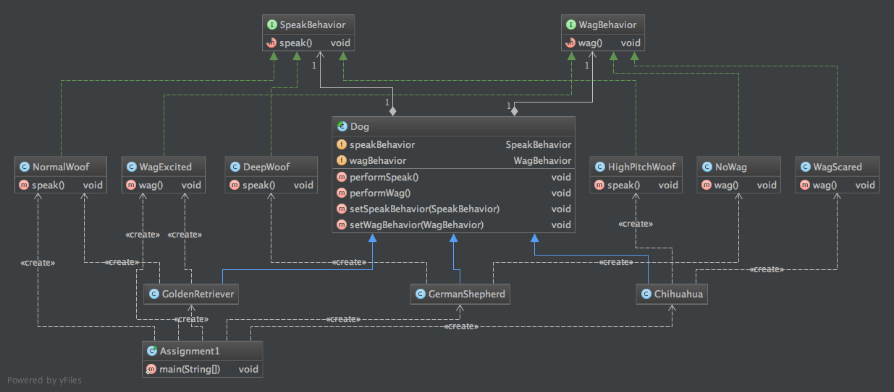

## Assignment 2
##### Observer pattern
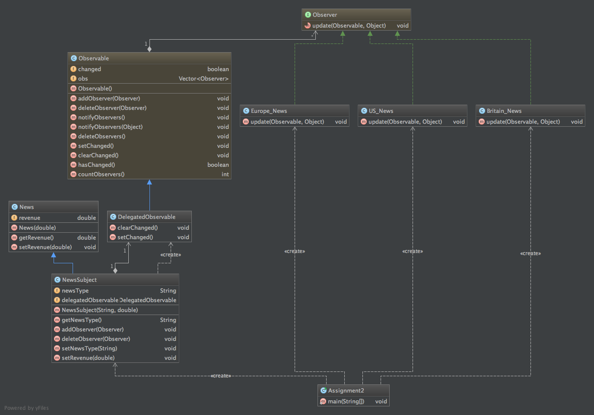

## Assignment 3
##### Decorator pattern
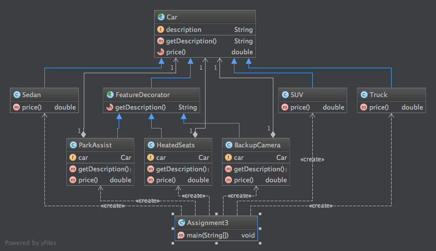

## Assignments 4 & 5
##### Factory and Singleton patterns
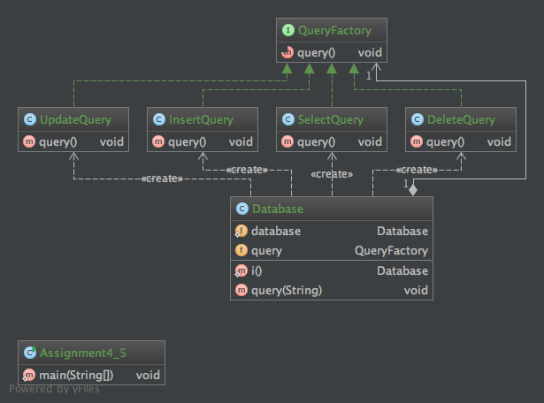

## Assignment 6
##### Command pattern
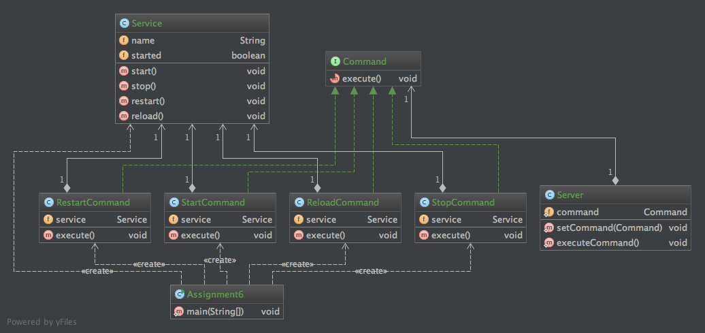

## Assignment 7
##### Adapter pattern
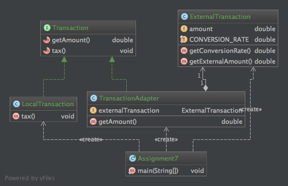

## Assignment 8
##### Facade pattern
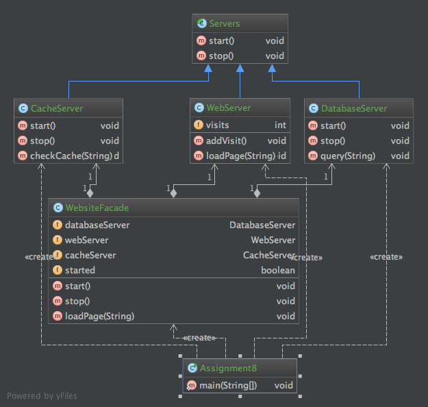

## Assignment 9
##### Iterator pattern
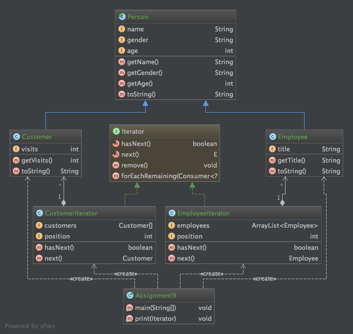

## Assignment 10
##### Composite pattern
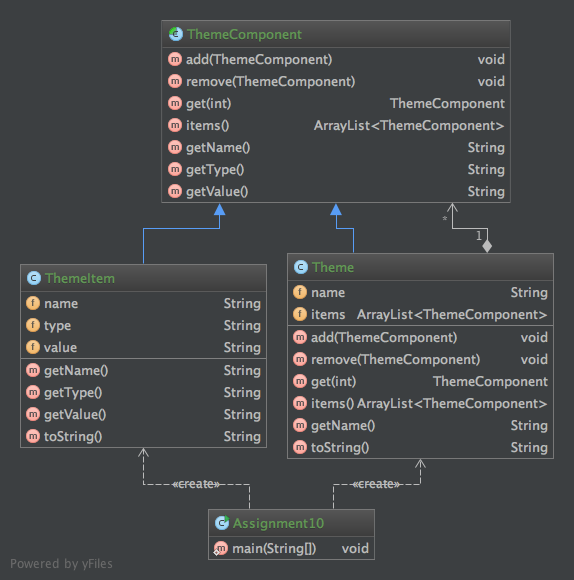

## Assignment 11
##### Template pattern
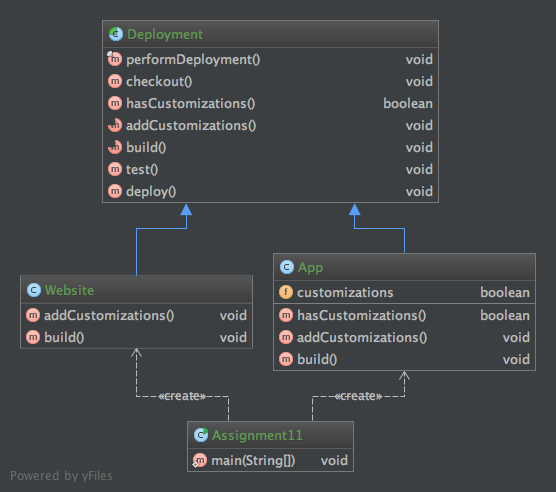

## Assignment 12
##### MVC pattern
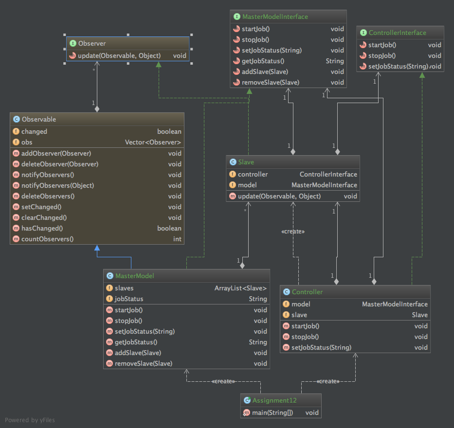
